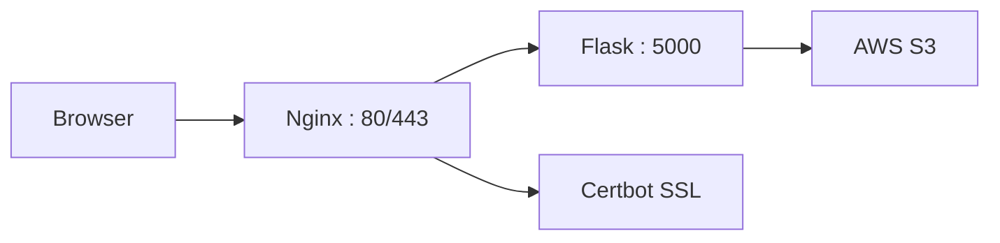

# Beyonity Docker Nginx Certbot Artist Portal

## IT Administrator
**Israr Sadaq**  
CCNA | CCNP | Master in Information and Communication Engineering  
Email: israrsadaq057@gmail.com  
GitHub: https://github.com/israrsadaq057-art  

---

## Project Overview

Containerized artist portal for Beyonity using Docker Compose with Nginx reverse proxy, Flask web application, and Certbot SSL automation. Artists can upload, download, and delete 3D assets stored in AWS S3.

---

## Architecture



---

## Docker Compose Services

| Service | Container        | Port     | Purpose              |
|--------|------------------|----------|----------------------|
| Flask  | beyonity-flask   | 5000     | Python web app       |
| Nginx  | beyonity-nginx   | 80, 443  | Reverse proxy        |
| Certbot| beyonity-certbot | -        | SSL automation       |

---

## Features

- Multi-container orchestration with Docker Compose  
- Nginx reverse proxy routing to Flask  
- Certbot automatic SSL certificate renewal  
- Container networking between services  
- 16 artist login system  
- Upload, download, delete files from S3  
- Professional UI with glassmorphism design  

---

## Artists

```
anna, ben, carla, david, elena, felix, grace, henry,
irena, jonas, karla, lukas, mona, niklas, olivia, paul
```

---

## File Structure

```bash
beyonity-docker-nginx-certbot/
├── Dockerfile
├── docker-compose.yml
├── nginx.conf
├── requirements.txt
├── app.py
├── templates/
│   ├── login.html
│   └── dashboard.html
├── certbot/
│   ├── conf/
│   └── www/
└── README.md
```

---

## Quick Start

```bash
git clone https://github.com/israrsadaq057-art/beyonity-docker-nginx-certbot.git
cd beyonity-docker-nginx-certbot
docker-compose build
docker-compose up -d
docker-compose ps
```

---

## Verification Commands

```bash
docker ps
docker-compose ps
docker logs beyonity-flask --tail=20
curl http://localhost
```

---

## Skills Demonstrated

| Skill           | Implementation                  |
|----------------|--------------------------------|
| Docker         | Containerized Flask app        |
| Docker Compose | Multi-container orchestration  |
| Nginx          | Reverse proxy configuration    |
| Certbot        | SSL certificate automation     |
| Flask          | Python web framework           |
| AWS S3         | Cloud storage                  |
| Boto3          | AWS SDK                        |

---

## ScreenShots

---
## Running Docker Compose

 

## Simple Portal for Artists


## Installing Python in EC2 Instance


## Running NGINX


## Ading HTTPS-HTTP Port to Security Group


